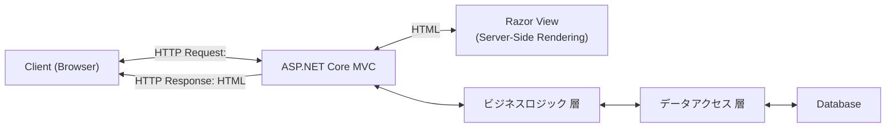
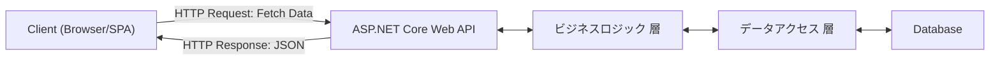

# アーキテクチャー構造の違いによるUIへの影響

これらの図は、現行システムの構造と動作フローを把握するために作成しました。  
一般的に`プレゼンテーション層`と言われる部分である、`Web API` を利用した構造と`サーバーサイド MVC` の違いを明確にすることが目的です。

おそらくは、この差によりフロントエンド作業（改修負荷）が異なってくると考えられます。  
また、この構造を把握させしてしまえば、どこをターゲットとして回収が必要かの目安となり、見積もりの参考にはなると思います。

※ 資料が .NET にフォーカスしているため、Java システムを考慮する場合は「`Web API 的な構造`」と「`MVC 的な構造`」と読み替えても良いかと思います。

### TODO: 確認する根拠を示す

## １. 従来のサーバーサイド生成型 MVC

シンプルな設計であり、サーバー側で完全制御を行うが、ユーザー体験がリフレッシュベースで負荷が高くなりがち。

### サーバーサイド MVC
- サーバーで HTML を生成してクライアントに送信。
- レスポンスが画面単位で一括レンダリングされる。

### プレゼンテーション層の一部としての役割
- `ASP.NET Core MVC` は Model-View-Controller アーキテクチャに基づき、特に「`Controller`」と「`View`」の連携によってプレゼンテーション層を構成します。
- `Controller`: クライアントからのリクエストを受け取り、ビジネスロジック層と連携し、結果を View に渡します。
- `View`: Razor ビューエンジンを使用して、サーバーサイドで HTML を生成します。

つまり、
- `MVC` 全体（特に `Controller` と `View`）は`プレゼンテーション層`を構成します。
- `Controller` 自体が`プレゼンテーション層`の「処理を管理する役割」を持ち、`View` と連携して画面表示を担います。

## ２. Web API 経由のフロントエンド実装

フロントエンドとバックエンドの分離により、モダンなクライアントアプリ（SPA）との統合が可能になり、将来的にPWA やモバイル対応が容易です。

### Web API 経由
- フロントエンド（SPA）が独立して動作し、`JSON` データを受け取って描画します。
- より柔軟でモダンなクライアント体験を提供します。

### プレゼンテーション層の一部としての役割
- `ASP.NET Core Web API` は、クライアント（例えば、SPA フロントエンド、モバイルアプリ、他のシステム）とサーバー間のやり取りを担当します。
- `Controller`: RESTful API のエンドポイントとして機能し、クライアントからのリクエストを受け、データを返します（通常は JSON）。
- 画面表示は担当せず、データの受け渡し（プレゼンテーション層の API 部分）に特化しています。

つまり、
- `ASP.NET Core Web API` の `Controller` は「`プレゼンテーション層`の API 部分」として動作します。
- `View` はなく、データの提供に特化しているため、`プレゼンテーション層`の一部でありながら、「ビジュアル」な要素は持ちません。

## .NET の Controller の位置づけ

### Controller とは？
- `ASP.NET Core MVC`: ユーザーリクエストを受け、Razor ビュー（HTML）を生成してレスポンスする部分。
- `ASP.NET Core Web API`: REST API のエンドポイントとして、JSON や XML を返す部分。

### Controller の層について
- プレゼンテーション層の管理ロジックとして動作し、クライアントからのリクエストを「どのビジネスロジックに渡すか」を決定します。
- `Controller` 自体がビジネスロジックを持つべきではなく、必要に応じてサービス層やリポジトリ層に処理を委譲します。

## 利点比較

|項目|ASP.NET Core MVC|ASP.NET Core Web API|
|---|---|---|
|目的|HTML を生成し、クライアントに返す|データ（JSON、XML）をクライアントに返す|
|プレゼンテーション層の範囲	|Controller + View（HTML レンダリング含む）|Controller のみ（データ提供に特化）|
|役割|ユーザー向け画面を生成する|ユーザー向け画面を生成する|
|依存関係|Razor ビューエンジンを使用|JSON シリアライゼーションを使用|
|フロントエンド構成|画面遷移単位で構成|SPA/モバイル対応可能|
|ユーザー体験|リフレッシュベース|リッチでモダンなクライアント体験を提供|
|実装負荷|一体型のため比較的実装が容易|フロントエンドとバックエンドの連携が必要|
|適応性|サーバーで完全に制御可能|モダン技術（React, Vue など）と統合可能|

## IEモード

IEモードにて対応するかどうか？によっても作業負荷が異なります。  
IEモードであれば、MVCの構造で、HTMLを生成する部分の改修で十分と思いますが、「2029年にサポート切れ」の課題は残ります。

