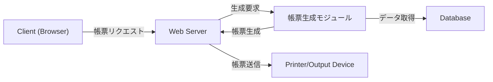
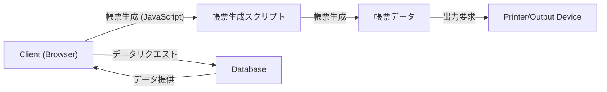

# システムの構造の違いによる帳票への影響
出力方法や出力デバイスに焦点を当て、IE から Edge への移行に伴う懸念事項と影響を記載しています。

本資料は、現行システムの構造および帳票出力に関わる動作フローを把握するために作成されました。

帳票出力は、UI だけでなくシステムのハードウェア依存性や出力先デバイスの違いが大きな影響を与えるため、出力方法やデバイスの観点から注意すべき点を明確にすることが目的です。

以下の内容をもとに、出力処理の影響範囲を把握し、移行時の課題や改修負荷を検討する際の参考としてください。

## 1. 帳票出力方法と構造の違い

帳票出力の方法は、システム構造の違いによって異なります。以下にサーバーサイド生成型とクライアントサイド生成型の帳票出力の構造を示します。

1.1 サーバーサイド生成型帳票

- 帳票生成の主な処理はサーバー側で実行され、ブラウザやクライアントの負荷を軽減します。
- 出力先: プリンター、PDF ファイル、クライアント PC にダウンロード可能。
- 適用範囲: ActiveX やサーバーサイドツール（例: JasperReports）に依存する構成が多い。

### 1.2 クライアントサイド生成型帳票

- クライアントサイドで帳票が生成され、ブラウザの能力に依存します。
- 出力先: ダウンロードやローカルのプリンター。
- 適用範囲: JavaScript ライブラリ（例: SheetJS、PDF.js）を活用した構成。

## 2. 出力方法による懸念事項

### 2.1 出力方法の違い

|出力方法|IE 依存 |Edge 依存|
|---|---|---|
|サーバーサイド出力|ActiveX やサーバーサイドツールを利用。プリンターや PDF 出力を一括管理|サーバーサイドツールはそのまま利用可能だが、ActiveX に依存する部分を排除する必要あり|
|クライアントサイド出力|ActiveX を使用して直接プリンターへ送信可能（例: ActiveXObject('Printer')）。JavaScript に非対応の部分あり。|JavaScript ライブラリ（SheetJS、PDF.js など）を利用して帳票を生成・ダウンロード。ActiveX は使用不可|

### 2.2 出力場所による影響

|出力場所|IE の懸念事項 |Edge の懸念事項|
|---|---|---|
|プリンター|ActiveX を利用した直接印刷が可能。プリンターの設定に依存。|ActiveX 非対応。ブラウザの印刷機能や JavaScript ベースの制御に切り替える必要あり。|
|ローカル保存|ファイルダウンロードには msSaveBlob などの非標準 API を使用。|標準 API（Blob や URL.createObjectURL）を使用する必要がある。|
|PDF 出力|ActiveX や COM コンポーネントを利用した PDF 出力が主流。|クライアント側で PDF.js やサーバーサイドでの PDF 生成ツールを使用する必要がある。|
|クラウドストレージ|クラウドストレージ連携は限定的（特に IE のセキュリティ制約）。| Edge はモダンな API をサポートしており、クラウドストレージとの統合が可能 （例: Google Drive, OneDrive）|

## 3. 確認すべき技術的要素

### 3.1  ActiveX 依存の排除
Edge は ActiveX を完全に非対応とするため、これに依存したプリンター制御や PDF 出力機能を再設計する必要があります。

1. 帳票の生成や印刷に ActiveX を使用していないか。
2. ActiveX を排除する代替方法（例: サーバーサイド生成や JavaScript ベースの印刷）が確立されているか。

### 3.2 印刷スタイル（@media print）の適用
Edge は @media print の標準仕様を厳密に守るため、IE 用のカスタムスタイルが崩れる可能性があります。

1. 帳票レイアウトが印刷用スタイルに基づいて正しく表示されるか。
2. 不要な要素（例: メニューや広告）が非表示になるか。

### 3.3 MIME タイプとエンコードの確認
Edge のセキュリティポリシーは IE より厳格で、MIME タイプやエンコードが正しく設定されていないとダウンロードがブロックされる可能性があります。

1. サーバーサイドで生成されるファイルの MIME タイプが正しいか（例: application/pdf、text/csv）。
2. CSV や Excel ファイルのエンコード形式（UTF-8/BOM、Shift-JIS）が適切か。

### 3.4 JavaScript ベースの帳票生成
Edge では JavaScript ライブラリを活用してクライアントサイドで帳票を生成することが推奨されます。

1. SheetJS や PDF.js など、モダンなライブラリを利用した帳票生成が正しく動作するか。
2. ファイルのダウンロード処理がポップアップブロックによって妨げられていないか。

## 4. 結論

システム構造の違いによる帳票出力への影響は、次のように整理できます：
- サーバーサイド中心の帳票生成
   - ActiveX や非標準技術の排除が必要
   - サーバーサイドツールや標準 API を活用する
- クライアントサイド中心の帳票生成
   - JavaScript ライブラリを活用し、エンコードや MIME タイプに注意を払う
   - 印刷スタイルやセキュリティポリシーを考慮した実装が求められる

